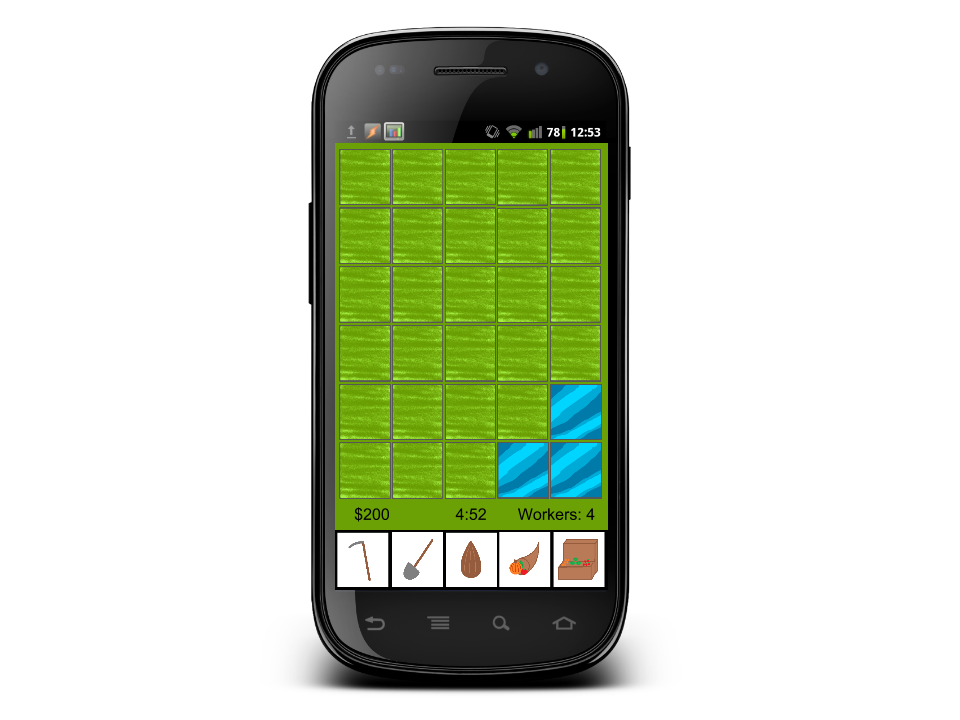
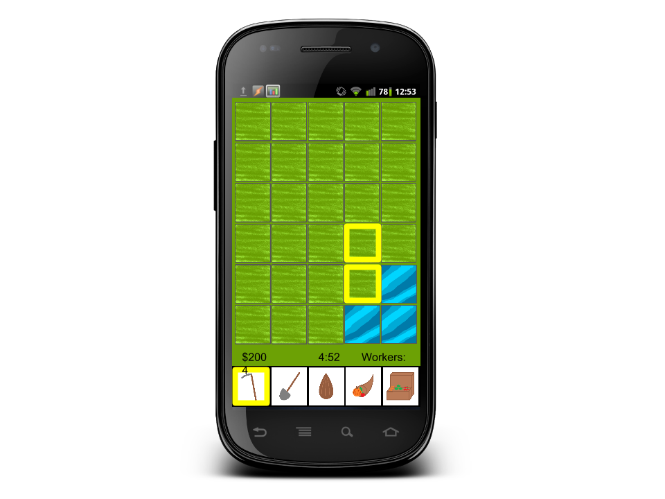
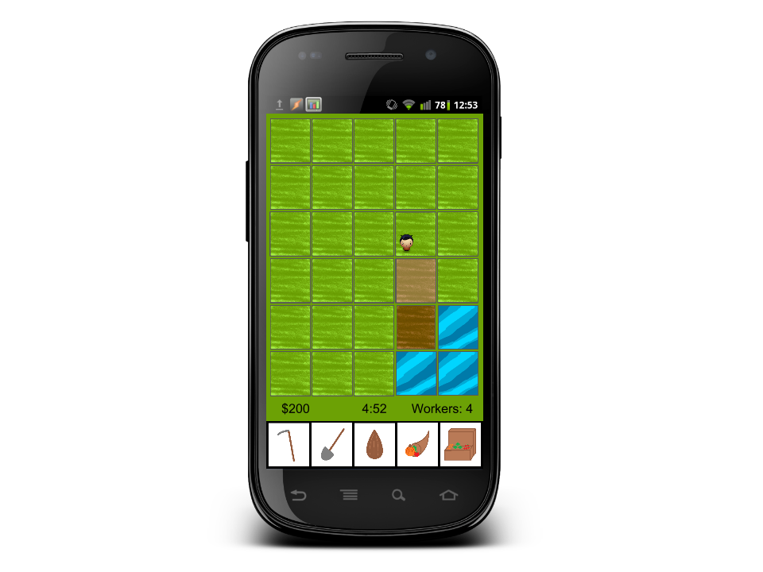

# Farm Adventure
Anthony Marion & Audrey Meinders
## What this presentation will cover
* SEMADevelopment - goals
* How AA Software can help
* Our initial game idea
* Feasibility testing
* One lengthy storyboard
* Game architecture
* Schedule
## SEMADevelopment
* TODO Details Here
## Problem
"Develop an entertaining mobile application"

But how? {. class="fragment"}
## Our Idea
* Farming simulation game
* Fast-paced
* Workers
* Scoring
* A campaign
## Feasibility Study
* Single Player {. class="fragment"}
* Multiplayer - Competitive {. class="fragment"}
* Multiplayer - Cooperative {. class="fragment"}
## Feasibility Study - Criteria & Methods
* Connectivity and Bandwidth requirements
* Server infrastructure costs
* Development time expectations
* High quality
* Ease of learning
* Adherance to budget
* Appeal to target demographic
## Evaluation - Single Player
* Connectivity and Bandwidth requirements
* Server infrastructure costs
* Development time expectations
## Evaluation - Cooperative Multiplayer
* Connectivity and Bandwidth requirements
* Server infrastructure costs
* Development time expectations
## Evaluation - Competitive Multiplayer
* Connectivity and Bandwidth requirements
* Server infrastructure costs
* Development time expectations
## Feasibility Study - Conclusion
* TODO: Summarize the evaluation via a chart
## Objectives
* Functional
    * Campaign
    * Core Gameplay
* Non-Functional
* Acceptance Criteria
* Applicable Standards
## Architecture
## Prototype
## Basic Layout

## Plowing

## Plowing

## Schedule - Sprint 1
* Runs on Android OS
* One farm, one season
* Inventory
* Plowing, planting, irrigation, harvesting
## Schedule - Sprint 2
* World map
* Spells
* Bank balance
* Marketplace - one equipment, plant, spell
* Hire and fire workers
## Schedule - Sprint 3
* Main menu, options menu
* Final graphics
* Scoring
* All content (farms, seasons, plants, etc)
* 25 Frames Per Second
* Passes PMD code scan
## In reflection
* What we learned
    * Team cohesion is very important
* What would we have done differently
    * Planned better around homework
* What we will do differently next semester
    * TODO
* What we need
    * Android and OpenGL experts
    * Art assets
## Conclusion
* TODO
# THE END (!)
<small>Questions?</small>
